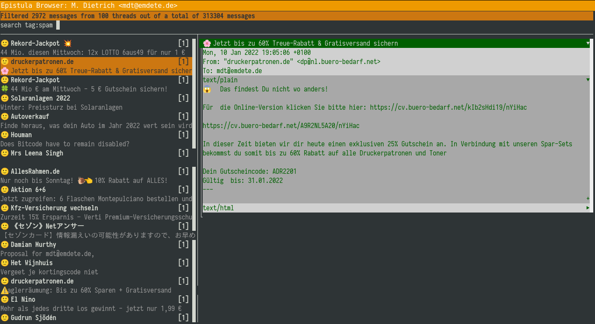

Epistula
==

The original source is maintained at [codeberg](https://codeberg.org/mdt/epistula), please do PRs & issues here.

Itching
--

> Every open source project begins with an itching

this is about a huge itchy reaction on the current state of email processing, code production explosion and memory consumption inflation i had. it was an terrible itching.

if you want to code one of the most hip IDEs is fact based on a browser. it eats memory, contains millions of code lines, installs 330MB for an editor. same goes for a chat client. so when i looked over the alternatives for the chat client you had the choice between various GUI projects which more or less did not implement the desired features or where based on QT. only [gomuks](https://github.com/tulir/gomuks) worked for me out of the box. incredible well even. while that one was based on console out. it's not even a GUI but a CUI. still it displays images (or thumbnails of that). it's written in [go](https://go.dev/) and uses tcell.

i wondered if there is an email MUA with a similar concept. i did not find any. so i started my own.

Decisions
--

i need four areas: an area to show a mail thread, an area to list the mail threads, an area to enter a query term, an area to show some status information.

i code in [Go](https://pkg.go.dev/).

i decided to have no focus control over widgets. the keys tell, which area will use them. page up/down navigates emails, cursor up/down navigates thread list, cursor left/right and chars work on the query term (more keys to come). Mouse clicks will routed by area.

i decided to have no fancy model view controler stuff or the like. no layout manager, just hardcoded positions. visualisation merges with function, no widget abstraction. everything is based on putting chars or strings onto the screen.

the program is consequently using PGP.

i decided to use the components

- [tcell](github.com/gdamore/tcell/v2) to do CUI
- [notmuch](github.com/zenhack/go.notmuch) to query mails
- [gpgme](github.com/proglottis/gpgme) to decode mails
- [gmime](github.com/sendgrid/go-gmime) to parse mails

So mainly the project is just a driver for those fine libraries.



Preconditions
--

while i was a big fan of rxvt i switched to [gnome-terminal](https://wiki.gnome.org/Apps/Terminal) recently because it has better support for all the fancy stuff tcell supports like more colors, mouse reporting, double width characters and so on. Editing mails will start another terminal which is gnome-terminal. This is hardcoded for now.

i use [NeoVim](https://neovim.org/) for editing. This is hardcoded for now.

i use [elinks](http://elinks.cz/) to translate anoying html mails to readable plain text. pandoc and w3m did not succeed in showing links.

i use the font [Iosevka](https://github.com/be5invis/Iosevka/) which gives proper, sharp letters and contains unicode special chars. Iosevka is a narrow font, if you prefer a wider font you can try "Roboto Mono" (see Google) which gives good results too.

i used

```
notmuch config set index.header.Autocrypt Autocrypt
notmuch reindex \*
```

to be able to find emails with public keys in the meta data.

i use `notmuch new --decrypt=true` and have decrypted data from my crypted email in the xapian database.

i use an external script to retrieve new mail and kick off `notmuch new`. After that the browser needs an event to refresh its query result. This is done by a unix signal USR1 which is send by a `killall -USR1 epistula-browser`.

Build
--

Just compile and run the program like this:

```
cd composer/
go build
cd ..
cd browser/
go build
./epistula-browser --from="..." 2>/tmp/e.log
```

Using
--

- editing the query: Mouse-Left-Click, Mouse-Scroll, Key-Left/Right, Characters (on top)
- navigating the result list of threads: Mouse-Left-Click, Mouse-Scroll, Key-Up/Down, Ctrl-Key-Up/Down (on the left)
- navigating the list of mails: Key-Page-Up/Down, Ctrl-Key-PageUp/Down (on the right)
- globally
	- Ctrl-Key-C: Compose an email
	- Ctrl-Key-R: Reply an email
	- Ctrl-Key-L: Refresh screen
	- Ctrl-Key-S: Tag as spam
	- Ctrl-Key-A: Archive, untag inbox
	- Ctrl-Key-O: Open further lines on a text part

Warning
--

This is POC code! It looks like spaghetti but that is intended as i am learning how i want my MUA to behave.

The program uses panic() on errors which immedialty terminate the program. This happens (more or less expected) if you navigate to quickly through your emails. This is because each screen update parses the entire mail thread each time and the program uses tcell event queue which will run full.

